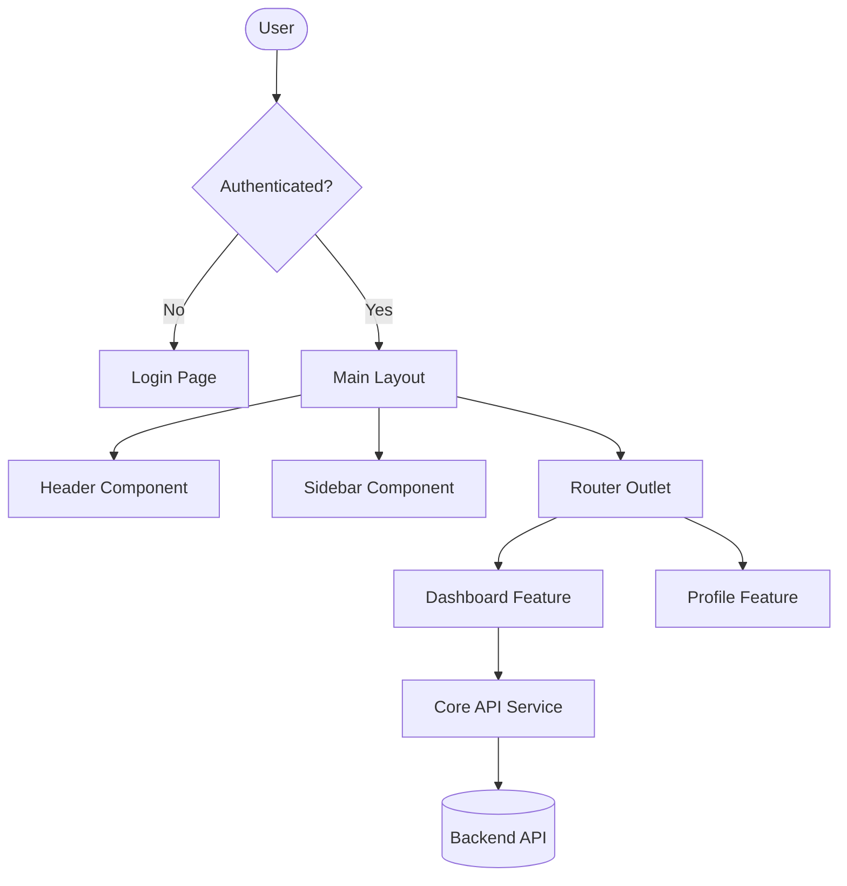

# Enterprise-Ready Angular Application

Built with Angular 21, following industrial best practices for scalability, security, and maintainability.

## Application Architecture

The application follows a **Modular Standalone Architecture**, ensuring low coupling and high cohesion.

### Folder Structure

```text
src/
├── app/
│   ├── core/           # Singleton services, guards, interceptors (Core logic)
│   ├── shared/         # Reusable UI components, pipes, directives
│   ├── features/       # Business modules (Dashboard, Auth, etc.)
│   ├── layout/         # Structural components (Header, Sidebar, Main Layout)
│   ├── data/           # Interfaces, Models, and Constants
│   ├── app.config.ts   # Global configuration
│   └── app.routes.ts   # Main routing configuration
├── assets/             # Static assets (images, icons)
└── styles/             # Global styles and theme tokens
```

## 📊 Flow Diagram



## 🛠️ Key Features

- **Scalable Structure**: Clear separation of concerns.
- **Standalone Components**: Modular and lightweight.
- **Type Safety**: Full TypeScript integration.
- **Enterprise Best Practices**: Using Core/Shared pattern.
- **Real-time Flow**: Centralized state management (Signal-based).

## 🚀 Getting Started

```bash
npm install
npm run start
```
